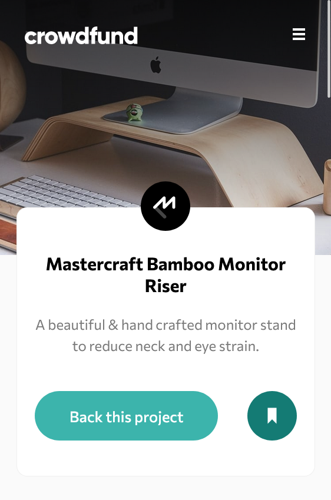

# Frontend Mentor - Crowdfunding Product Page

This is a solution to the [Crowdfunding Product Page challenge on Frontend Mentor](https://www.frontendmentor.io/challenges/crowdfunding-product-page-7uvcZe7ZRb). Frontend Mentor challenges help you improve your coding skills by building realistic projects.

## Table of contents

- [Overview](#overview)
  - [The challenge](#the-challenge)
  - [Screenshot](#screenshot)
  - [Links](#links)
  - [Built with](#built-with)
- [Author](#author)

## Overview

### The challenge

Your users should be able to:

- View the optimal layout depending on their device's screen size
- See hover states for interactive elements
- Make a selection of which pledge to make
- See an updated progress bar and total money raised based on their pledge total after confirming a pledge
- See the number of total backers increment by one after confirming a pledge
- Toggle whether or not the product is bookmarked

### Screenshot

### Links

- Solution URL: [Github Repo](https://github.com/Dev-Caesar/Crowd-funding-product-page)
- Live Site URL: [crowdfunding-product-page-live-site](https://dev-caesar.github.io/Crowd-funding-product-page/)

### Built with

- Semantic HTML5 markup
- CSS custom properties
- Flexbox
- CSS Grid
- Mobile-first workflow
- JavaScript

## Author

- Frontend Mentor - [@Dev_Caesar](https://www.frontendmentor.io/profile/Dev-Caesar)
